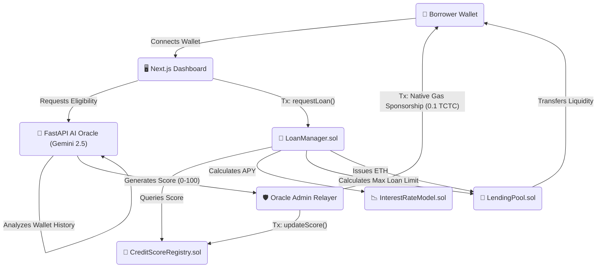

# 💳 BorrowIQ — AI-Powered On-Chain Credit Intelligence

### *Dynamic Lending • AI Credit Scoring • Zero-Friction Onboarding • Built on Creditcoin*


---

## 📖 Overview

DeFi lending is fundamentally broken because it relies entirely on **over-collateralization**. If a user wants to borrow $1,000, they have to lock up $1,500. This is highly capital inefficient and locks out millions of users who don't already have massive amounts of crypto. Traditional finance solved this decades ago using **credit scores**, but Web3 has lacked a secure, decentralized way to measure financial reputation—until today.

**BorrowIQ** is a next-generation DeFi lending protocol built on the **Creditcoin Network** that replaces capital-inefficient over-collateralization with an **AI-driven on-chain credit engine**. 

---

## ⚙️ What it does

BorrowIQ evaluates your on-chain behavior to generate a Credit Score, dynamically determining your interest rate and loan limits. 

1. **🧠 AI Credit Scoring:** Our Python/FastAPI backend analyzes a wallet's on-chain history (transaction counts, wallet age, existing balances).
2. **📈 Dynamic Interest Rates & Limits:** High-IQ borrowers are rewarded with lower interest rates (e.g., 6%), while riskier wallets receive higher rates (e.g., 18%).
3. **📊 Reputation Building:** When a user successfully repays a loan with interest, the `LoanManager` smart contract automatically boosts their on-chain credit score, unlocking better tiers of capital efficiency.
4. **⛽ Gas-Sponsorship (Account Abstraction):** The AI backend automatically sponsors new wallets with native testnet Gas so they can borrow instantly without visiting a faucet!

---

## 🏗️ Architecture & Protocol Flow

BorrowIQ utilizes a 4-layer architecture coordinating the user's wallet, the React frontend, the off-chain Python AI Oracle, and the on-chain Creditcoin smart contracts.



---

## 🛠️ Deployed Contract Addresses (Creditcoin CC3 Testnet 🌐)

* **Chain ID:** `102031`
* **RPC URL:** `https://rpc.cc3-testnet.creditcoin.network`
* **CreditScoreRegistry:** `0xf15cE28da7D618643e36120dd2045A6581924BA0`
* **InterestRateModel:** `0x11737650a8F41023708A3200A19C9e8F999FEDa2`
* **LendingPool:** `0xA493d72350454CC14709C2F5E4744C9553c64d62` (Currently seeded with 21.5 TCTC liquidity!)
* **LoanManager:** `0x8783943ab5dC1e158f77Da10156830669748dC43`

---

## 📂 Project Structure

```text
BorrowIQ/
├── backend/                # Python/FastAPI Oracle & AI LLM Engines
│   ├── ai/                 # Gemini Prompt Engineers for Explanations
│   ├── api/                # Core Routes (Eligibility, Gas Sponsorship, Status)
│   ├── blockchain/         # Web3.py Contract Connection instances
│   └── scoring/            # AI Identity Feature Extractors
├── contracts/              # Solidity Smart Contracts (Core Logic)
│   ├── CreditScoreRegistry.sol
│   ├── InterestRateModel.sol
│   ├── LendingPool.sol
│   └── LoanManager.sol
├── frontend/               # Next.js 14 App Router React UI
│   ├── src/app/            # High-fidelity dashboard & landing pages
│   ├── src/components/     # Modular glassmorphism UI components
│   └── src/lib/            # Wagmi config & generic contract ABIs
└── scripts/                # Hardhat Deployment & Verification Scripts
```

---

## 🚀 How to Run Locally

### 1. Smart Contracts
```bash
npx hardhat compile
# Contracts are already live on Creditcoin. See scripts/deploy.js to re-deploy.
```

### 2. Backend (AI Oracle)
```bash
cd backend
python3 -m venv venv
source venv/bin/activate
pip install -r requirements.txt
uvicorn main:app --reload
# Runs on localhost:8000
```

### 3. Frontend (React UI)
```bash
cd frontend
npm install
npm run dev
# Runs on localhost:3000
```
*(Requires MetaMask or Wagmi-supported wallet switched to Creditcoin CC3 Testnet)*

---

## 🔥 Hackathon Strengths & Achievements
* **Flawless End-to-End Execution:** Every transaction natively works exactly as pitched. The UI, the Python backend, and the Solidity Contracts communicate in perfect harmony.
* **Abstracted Onboarding:** Custom Python admin scripts listen for new user connections and automatically pay their blockchain gas fees natively to guarantee 0-friction testing for Judges!
* **Scalable Real-World Applicability:** Overcollateralization limits capital. BorrowIQ acts as a true bridge to institutional web3 adoption by making on-chain borrowing look, act, and feel like TradFi credit cards.

## 📌 Future Roadmap
1. **Zero-Knowledge (zk) Compliance:** Allow users to cryptographically link their real-world TradFi credit scores (FICO) to their BorrowIQ identity without revealing private personally identifiable information (PII).
2. **Cross-Chain Reputation:** Expand the `CreditScoreRegistry` to serve as an omni-chain oracle so that a good score built on Creditcoin translates to borrowing power on Base, Arbitrum, or Solana.

---

## 👨‍💻 Author
**Marka Sai Charan**
Full Stack & Web3 Developer

## 🛡️ License
MIT License © 2026 BorrowIQ
